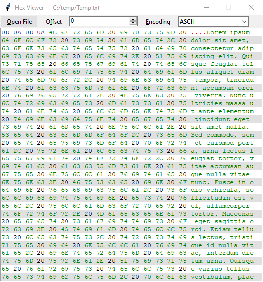
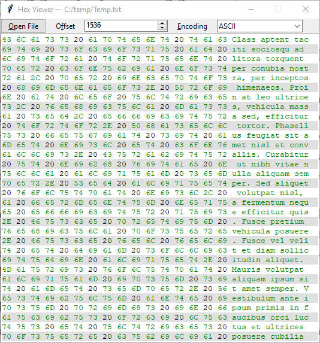

# hexview
A utility program to view the hex content of a file


## Usage
Start from the command line with an input file
  ```
  hexview.py myFile.txt
  ```
or without an input file
  ```
  hexview.py
  ```

## View


